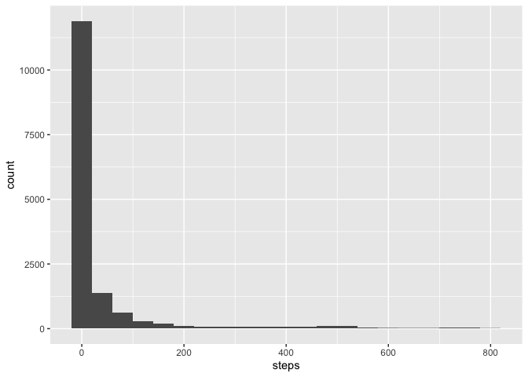
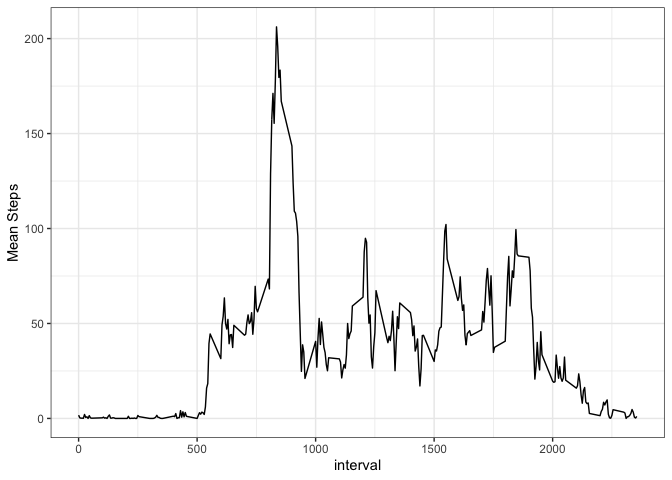
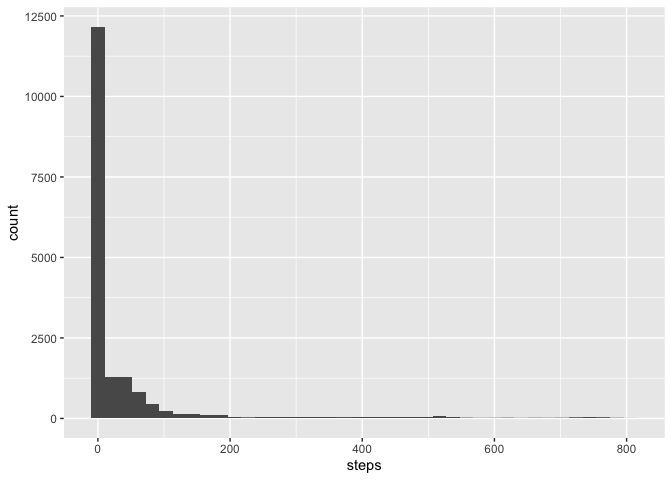
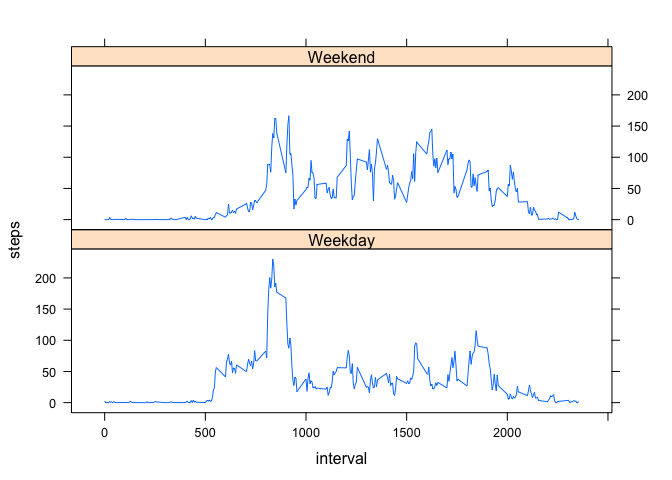

# Loading and preprocessing the data

The only different in the data is I changed the date column into a date object.

```r
data1<-read.csv("activity.csv")

#change to date/time object.
data1$date<-ymd(data1$date)
```

## What is mean total number of steps taken per day?


```r
steps_mean<-mean(data1$steps, na.rm=TRUE)
steps_mean
```

```
## [1] 37.3826
```


## Calculate the total number of steps taken per day


```r
daysteps<-data1%>%
  group_by(date)%>%
  summarize(day_steps=sum(steps, na.rm=TRUE))

daysteps
```

```
## # A tibble: 61 x 2
##    date       day_steps
##    <date>         <int>
##  1 2012-10-01         0
##  2 2012-10-02       126
##  3 2012-10-03     11352
##  4 2012-10-04     12116
##  5 2012-10-05     13294
##  6 2012-10-06     15420
##  7 2012-10-07     11015
##  8 2012-10-08         0
##  9 2012-10-09     12811
## 10 2012-10-10      9900
## # … with 51 more rows
```


#Make a histogram of the total number of steps taken each day


```r
#removed the nas from the data set for this step

histdata<-data1[!is.na(data1$steps),]

g<-ggplot(histdata)+geom_histogram(aes(x=steps), binwidth=40)
g
```

<!-- -->

## Calculate and report the mean and median of the total number of steps taken per day


```r
avgsteps<-data1%>%
  group_by(date)%>%
  summarise(mean_steps=mean(steps, na.rm=T), median_steps=median(steps, na.rm=T))

avgsteps
```

```
## # A tibble: 61 x 3
##    date       mean_steps median_steps
##    <date>          <dbl>        <dbl>
##  1 2012-10-01    NaN               NA
##  2 2012-10-02      0.438            0
##  3 2012-10-03     39.4              0
##  4 2012-10-04     42.1              0
##  5 2012-10-05     46.2              0
##  6 2012-10-06     53.5              0
##  7 2012-10-07     38.2              0
##  8 2012-10-08    NaN               NA
##  9 2012-10-09     44.5              0
## 10 2012-10-10     34.4              0
## # … with 51 more rows
```

## What is the average daily activity pattern?


```r
activity<-data1%>%
  group_by(interval)%>%
  summarize(avg=mean(steps, na.rm=T))

g<-ggplot(activity)+geom_line(aes(x=interval, y=avg))+
  theme_bw()+ylab("Mean Steps")
g
```

<!-- -->
# Which 5-minute interval, on average across all the days in the dataset, contains the maximum number of steps?


```r
activity[max(activity$avg),]
```

```
## # A tibble: 1 x 2
##   interval   avg
##      <int> <dbl>
## 1     1705  56.3
```
         
##Imputing missing values

I decided to use the average steps for the interval time to impute the values.


```r
dim(data1[is.na(data1$steps),])[1]
```

```
## [1] 2304
```

```r
##seperated the data into na and not na
data2nona<-data1[!is.na(data1$steps),]
data2na<-data1[is.na(data1$steps),]

##merge the average values into the na data set
data2na<-data2na[,-1]
data2na<-left_join(data2na, activity)
```

```
## Joining, by = "interval"
```

```r
data2na<-data2na[,c(3,1,2)]
names(data2na)[1]<-"steps"
data2na$steps<-round(data2na$steps, 0)

##put them both back together
data3<-rbind(data2nona, data2na)
data3<-data3%>%
  arrange(date, interval)
```

##Make a histogram of the total number of steps taken each day and  Do these values differ from the estimates from the first part of the assignment? What is the impact of imputing missing data on the estimates of the total daily number of steps?

The only real difference I see is in some of the median values. No difference in the mean values.


```r
g<-ggplot(data3)+geom_histogram(aes(x=steps), bins=40)
g
```

<!-- -->


```r
avgsteps2<-data3%>%
  group_by(date)%>%
  summarise(mean_steps=mean(steps, na.rm=T), median_steps=median(steps, na.rm=T))

avgsteps2
```

```
## # A tibble: 61 x 3
##    date       mean_steps median_steps
##    <date>          <dbl>        <dbl>
##  1 2012-10-01     37.4           34.5
##  2 2012-10-02      0.438          0  
##  3 2012-10-03     39.4            0  
##  4 2012-10-04     42.1            0  
##  5 2012-10-05     46.2            0  
##  6 2012-10-06     53.5            0  
##  7 2012-10-07     38.2            0  
##  8 2012-10-08     37.4           34.5
##  9 2012-10-09     44.5            0  
## 10 2012-10-10     34.4            0  
## # … with 51 more rows
```

```r
avgsteps
```

```
## # A tibble: 61 x 3
##    date       mean_steps median_steps
##    <date>          <dbl>        <dbl>
##  1 2012-10-01    NaN               NA
##  2 2012-10-02      0.438            0
##  3 2012-10-03     39.4              0
##  4 2012-10-04     42.1              0
##  5 2012-10-05     46.2              0
##  6 2012-10-06     53.5              0
##  7 2012-10-07     38.2              0
##  8 2012-10-08    NaN               NA
##  9 2012-10-09     44.5              0
## 10 2012-10-10     34.4              0
## # … with 51 more rows
```

```r
##
```


#Create a new factor variable in the dataset with two levels – “weekday” and “weekend” indicating whether a given date is a weekday or weekend day.


```r
data3$wd<-weekdays(data3$date)
data3$daytype<-"Weekday"
data3$daytype[data3$wd=="Saturday"|data3$wd=="Sunday"]<-"Weekend"
```


#Make a panel plot containing a time series plot of the 5-minute interval (x-axis) and the average number of steps taken, averaged across all weekday days or weekend days (y-axis). 


```r
plotdata<-data3%>%
  group_by(daytype, interval)%>%
  summarize(steps=mean(steps))


with(plotdata, xyplot(steps~interval|factor(daytype), type="l", layout=c(1,2)))
```

<!-- -->
